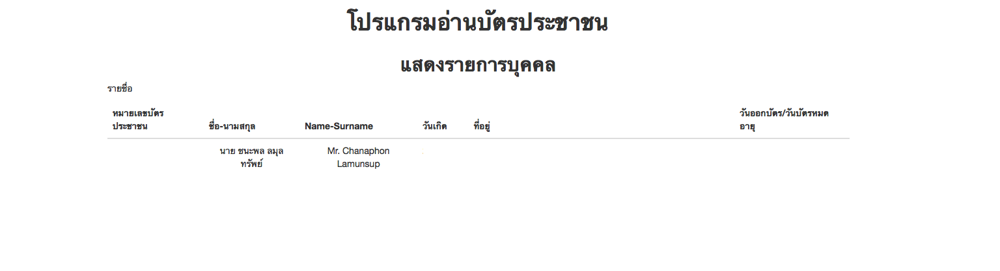

#IOSmartID

-----------------

#SMART CARD READER
Alcor Micro AU9540

Emits events for:

* device-activated
* device-deactivated
* card-inserted
* card-removed
* issue-command
* receive-response
* error

## Compatible Readers

Tested on Mac OSX with the Alcor Micro AU9540 Smart Card Reader. 

 

   

   

